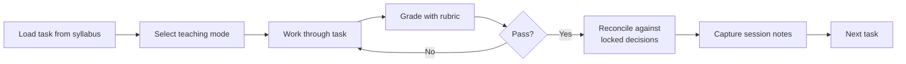
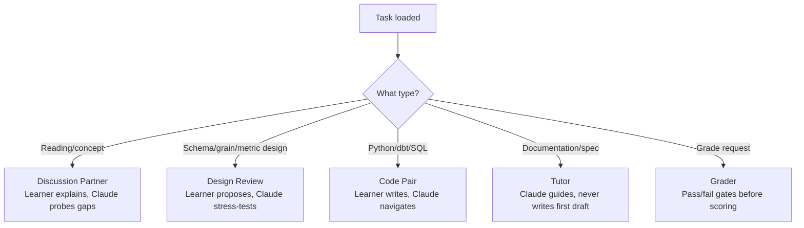
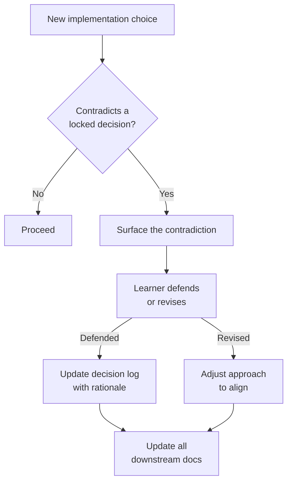

# Philadelphia-LandUse-Analytics

An analytics platform that explains how Philadelphia's 18 planning districts change over time, using public datasets — building permits (L&I), zoning reclassifications, and ACS demographic context.

## Current status

> **Month 2 in progress — building the local MVP.**
> Month 1 (design & documentation) is complete. Now implementing Dockerized Postgres/PostGIS, Python ingestion, dbt models, and Metabase dashboards.

| Component | Status |
|-----------|--------|
| Warehouse design (grain, schema contracts, ERD) | ✅ Complete |
| Dataset cataloging (4 datasets) | ✅ Complete |
| Metric specifications (7 metrics) | ✅ Complete |
| Product specs (district brief, compare view) | ✅ Complete |
| Docker Compose stack (Postgres + PostGIS + Metabase) | ✅ Running |
| Database bootstrap (schemas, extensions) | ✅ Verified |
| Python project scaffold | ✅ Complete |
| dbt project scaffold | ✅ Complete |
| Planning districts vertical slice | 🔧 In progress (Days 28–31 done) |
| Permits vertical slice | 🔲 Week 7 |
| Zoning vertical slice | 🔲 Week 8 |
| ACS + dashboards | 🔲 Week 9 |

## Locked decisions

- **Stack:** Postgres + PostGIS + Python + dbt + Metabase + Docker
- **Modeling:** dbt `stg_*` → `dim_*/fct_*` with district-time grain
- **Metric normalization:** By land area (e.g., permits per sq mi)
- **Time scope:** Last 5 years
- **Comparison period:** Year-over-year
- **MVP scope:** Permits + zoning + ACS + district boundaries
- **Environment:** Local dev via Docker Compose; cloud out of scope

## Repo layout

```
├── docker/          # Compose file, service configs
├── src/philly_dw/   # Python ingestion package
├── dbt/philly_dw/   # dbt project
├── data/            # Local dev samples (not committed)
├── docs/            # Curated documentation (see docs index)
├── notes/           # Reading notes, scratch work
└── sql/             # Bootstrap SQL, ad-hoc queries
```

## Quick start

```bash
# Copy environment template
cp .env.example .env

# Start the stack
docker compose up -d

# Verify services
docker compose ps
make db-check
```

See [local dev runbook](docs/runbooks/local_dev.md) for full setup instructions.

## Documentation

Full docs index with one-line summaries: **[docs/README.md](docs/README.md)**

Key entry points:
- [Grain spec](docs/modeling/grain_spec.md) — row-level grain for all warehouse tables
- [ERD diagram](docs/diagrams/erd.mmd) — full MVP schema (Mermaid)
- [Decision log](docs/decision_log.md) — 17 locked architectural decisions
- [Limitations register](docs/limitations_register.md) — known constraints and mitigations

## Contributing

See [CONTRIBUTING.md](CONTRIBUTING.md) for workflow, branch naming, PR checklist, and local checks.

---

## How this was built: AI-assisted learning with design governance

This project is built with a structured AI learning system — not AI generating code, but AI acting as a teaching partner that enforces design rigor. The learning infrastructure was built iteratively through deep research with Claude and ChatGPT, starting from a curriculum roadmap and refined over 6 weeks into structured teaching modes, grading rubrics, and governance skills that protect architectural decisions as the codebase grows.

The core insight: as LLMs lower the barrier to writing code, the risk isn't that the code won't work — it's that it'll work *without anyone thinking about why it's built that way*. This system forces that thinking by challenging every design choice with counterarguments, checking new decisions against past ones, and requiring the learner to defend tradeoffs before anything gets built.

### The learning infrastructure

| Component | What it does | Location |
|-----------|-------------|----------|
| **Syllabus** | 53-day curriculum organized by week, with learning objectives and definitions of done per task | [.claude/syllabus.md](.claude/syllabus.md) |
| **Rubrics** | Task-specific grading criteria for all 100+ tasks | [.claude/rubrics.md](.claude/rubrics.md) |
| **Resource library** | 45+ curated resources (books, docs, videos) mapped to tasks | [.claude/resources.md](.claude/resources.md) |
| **Progress tracker** | Honest scoring — tasks graded 0-10, no inflated scores | [.claude/progress.md](.claude/progress.md) |
| **Teaching modes** | 5 modes with distinct engagement rules (see below) | [CLAUDE.md](CLAUDE.md) |
| **Governance skills** | Automated workflows for grading, reconciliation, syllabus adjustment, repo consistency | [.claude/commands/](.claude/commands/) |

### How a task flows through the system



### How teaching modes are selected



### How design decisions are protected



### The "second brain" effect

Every design choice in this project went through a challenge-and-defend cycle before being implemented. Some examples:

- **A new table emerged from discussion, not from a spec.** During a Kimball grain deep dive, the learner described wanting district-level histograms for ACS data. Working through the transformation chain, it became clear that adding bins to the existing table would violate its grain — so a new table (`agg_district_acs_attributes_hist`) was designed on the spot, with its own grain statement and PK. ([session notes](notes/learning_evidence/session_2026-03-08_task-11-1.md))

- **Implementation diverged from the syllabus — and the syllabus adapted.** The plan called for saving raw data to local files, then loading to PostGIS. During implementation, the learner chose to load directly to PostGIS. Instead of forcing compliance, the system checked the tradeoffs (lost: offline inspection; gained: simpler pipeline), confirmed the reasoning was sound, and updated the syllabus tasks to match reality. ([session notes](notes/learning_evidence/session_2026-03-14_task-30-5.md))

- **A Python vs dbt boundary debate produced a policy.** The learner asked whether Python could handle staging transforms. The discussion worked through two options, evaluated tradeoffs, and produced a write-access-by-layer policy that now governs the entire pipeline. After grading, the policy was *revised again* when an edge case surfaced. ([session notes](notes/learning_evidence/session_2026-03-10_task-25-3.md))

This isn't AI writing code faster. It's AI making sure the code that gets written is *thought through* — catching technical debt at design time, not after the dashboard breaks.

### Curated evidence

Selected session notes showing the system in action. Each includes the concepts discussed, the teaching mode used, and the learner's meta-learning reflection.

| Session | What it shows | Visual |
|---------|--------------|--------|
| [Grain deep dive](notes/learning_evidence/session_2026-03-08_task-11-1.md) | New table design emerged from Kimball concept discussion. Two failure modes clarified. | — |
| [ERD text draft](notes/learning_evidence/session_2026-03-08_task-11-2.md) | 9-entity warehouse designed through discussion. 4 architectural decisions made in one session. | — |
| [Zoning comparability](notes/learning_evidence/session_2026-03-08_task-8-6.md) | Three-layer complexity problem (physical reality vs regulatory framework vs administrative records). | [Lookup vs SCD2 vs Crosswalk](notes/learning_evidence/session_2026-03-08_task-8-6_lookup_vs_scd2_vs_crosswalk.html) |
| [ACS boundary alignment](notes/learning_evidence/session_2026-03-08_task-9-5.md) | MAUP, area-weighted interpolation, and why no crosswalk exists for city-defined boundaries. | [Area-weighted interpolation](notes/learning_evidence/session_2026-03-08_task-9-5_area_weighted_interpolation.html) |
| [Write access policy](notes/learning_evidence/session_2026-03-10_task-25-3.md) | Python vs dbt debate resolved through reasoning. Post-grade policy revision. | [Write access by layer](notes/learning_evidence/session_2026-03-10_task-25-3_write-access-by-layer.html) |
| [Reset workflow](notes/learning_evidence/session_2026-03-10_task-25-4.md) | Blast radius problem — escalating reset levels designed through tradeoff analysis. | [Reset blast radius](notes/learning_evidence/session_2026-03-10_task-25-4_reset_blast_radius.html) |
| [Full pipeline session](notes/learning_evidence/session_2026-03-14_task-30-5.md) | 9 tasks, 15+ concepts, all teaching modes in one session. The system at maturity. | [Full pipeline](notes/learning_evidence/session_2026-03-14_task-30-5_full_pipeline.html) |
